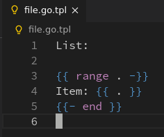
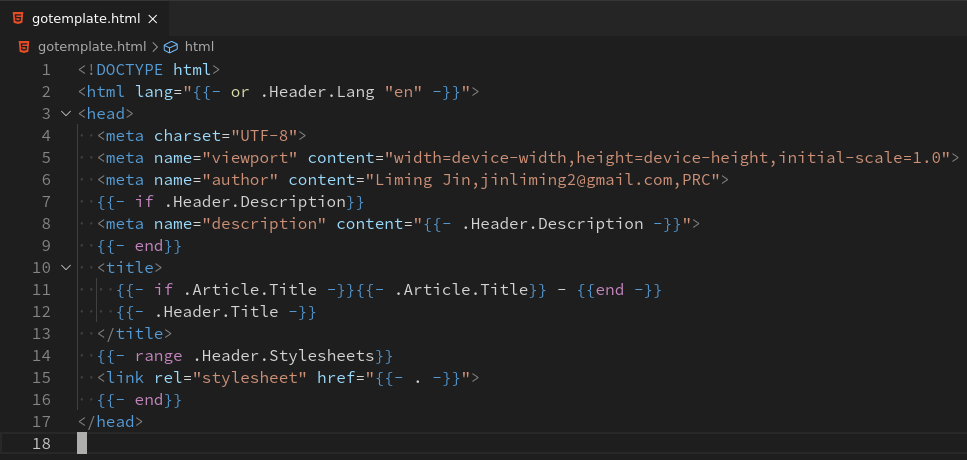
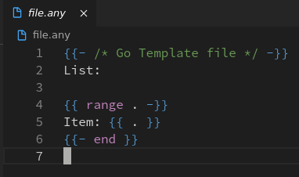

# Go Template Syntax Highlight Support for VSCode

Go Template Syntax Highlight Support for VSCode.

## Release

- **[Visual Studio Marketplace](https://marketplace.visualstudio.com/items?itemName=jinliming2.vscode-go-template) / Recommend**
- [GitHub Release](https://github.com/jinliming2/vscode-go-template/releases)

## Features

- Support syntax highlighting for Go Template files: `*.go.txt`, `*.go.tpl`, `*.go.tmpl`, `*.gtpl`.

   
- Support syntax highlighting for Go Template embedded in `HTML`, `JS`, and `CSS` files.

   
- Support syntax highlighting for Go Template embedded in unknown extension files which begin with Go Template Comment. Ex: `{{ /* Go Template */ }}`.

   

## Known Issues

1. Template syntax highlighting in JS and CSS files may cause syntax error.

## Release Notes

## [0.0.2] - 2020-12-09
### Added
- Support syntax highlighting for Go Template embedded in literal string in Go source file.
- Support syntax highlighting for Go Template files: `*.gtpl`.

### 0.0.1 (2020-09-09)

- Support syntax highlighting for Go Template files: `*.go.txt`, `*.go.tpl`, `*.go.tmpl`.
- Support syntax highlighting for Go Template embedded in `HTML`, `JS`, and `CSS` files.
- Support syntax highlighting for Go Template embedded in unknown extension files which begin with `{{ /* Go Template */ }}`.
